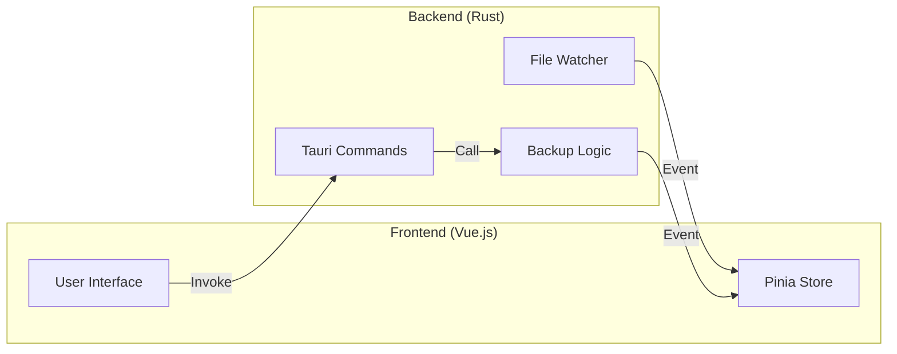

# システムアーキテクチャ

RepoSaver は、Tauri フレームワークを利用したマルチプロセス・デスクトップアプリケーションです。

## 技術スタック
- **Backend (Rust)**:
  - フレームワーク: Tauri v2
  - ファイル監視: `notify` クレート
  - 設定管理: `rust-ini` クレート (SettingsManager による独自実装)
- **Frontend (Vue.js)**:
  - フレームワーク: Vue.js 3 (Composition API)
  - UIコンポーネント: Vuetify 3
  - 状態管理: Pinia
  - 日時操作: dayjs

## プロセス構成
Tauri の基本設計に基づき、以下のプロセスで構成されます。

### 1. メインプロセス (Rust)
特権が必要な処理や、フロントエンドが閉じている間も継続すべき処理を担当します。
- **BackupSystem**: `notify` によるファイルシステム監視とバックアップ実行。
- **SettingsManager**: 設定ファイルの永続化。
- **System Tray**: 常駐制御とコンテキストメニュー。
- **Commands**: フロントエンドからの要求を処理する API エンドポイント。

### 2. ウェブビュープロセス (Vue.js)
ユーザーインターフェースとしての表示と、ユーザー操作の受付を担当します。
- **Main Window**: バックアップリストの表示、手動操作、設定変更。
- **Notification Window**: 透明なオーバーレイウィンドウとして動作し、状況通知を表示。

## プロセス間通信 (IPC)
通信は Tauri の `Invoke` (命令) と `Listen/Emit` (イベント) によって行われます。

